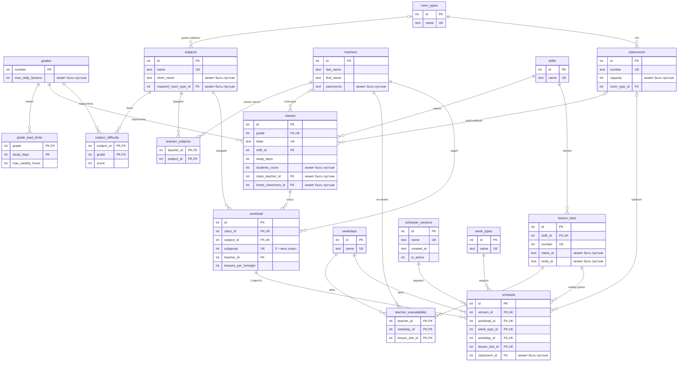

# Timetra

## Схема базы данных

```mermaid
erDiagram
  grades ||--o{ grade_load_limits : "лимит"
  grades ||--o{ classes : "параллель"
  grades ||--o{ subject_difficulty : "параллель"
  subjects ||--o{ subject_difficulty : "балл"
  subjects ||--o{ teacher_subjects : "предмет"
  teachers ||--o{ teacher_subjects : "может вести"
  teachers |o--o{ classes : "классрук"
  shifts ||--o{ classes : "смена"
  shifts ||--o{ lesson_slots : "звонки"
  classrooms |o--o{ classes : "свой кабинет"
  room_types |o--o{ subjects : "нужен кабинет"
  room_types ||--o{ classrooms : "тип"
  teachers ||--o{ teacher_unavailability : "не может"
  weekdays ||--o{ teacher_unavailability : "день"
  lesson_slots ||--o{ teacher_unavailability : "урок"
  classes ||--o{ workload : "класс"
  subjects ||--o{ workload : "предмет"
  teachers ||--o{ workload : "ведёт"
  workload ||--o{ schedule : "ставится"
  schedule_versions ||--o{ schedule : "вариант"
  week_types ||--o{ schedule : "неделя"
  weekdays ||--o{ schedule : "день"
  lesson_slots ||--o{ schedule : "номер урока"
  classrooms |o--o{ schedule : "кабинет"

  grades {
    int number PK
    int max_daily_lessons "может быть пустым"
  }
  grade_load_limits {
    int grade PK,FK
    int study_days PK
    int max_weekly_hours
  }
  classes {
    int id PK
    int grade FK,UK
    text letter UK
    int shift_id FK
    int study_days
    int students_count "может быть пустым"
    int class_teacher_id FK "может быть пустым"
    int home_classroom_id FK "может быть пустым"
  }
  subjects {
    int id PK
    text name UK
    text short_name "может быть пустым"
    int required_room_type_id FK "может быть пустым"
  }
  subject_difficulty {
    int subject_id PK,FK
    int grade PK,FK
    int score
  }
  teachers {
    int id PK
    text last_name
    text first_name
    text patronymic "может быть пустым"
  }
  teacher_subjects {
    int teacher_id PK,FK
    int subject_id PK,FK
  }
  teacher_unavailability {
    int teacher_id PK,FK
    int weekday_id PK,FK
    int lesson_slot_id PK,FK
  }
  shifts {
    int id PK
    text name UK
  }
  lesson_slots {
    int id PK
    int shift_id FK,UK
    int number UK
    text starts_at "может быть пустым"
    text ends_at "может быть пустым"
  }
  room_types {
    int id PK
    text name UK
  }
  classrooms {
    int id PK
    text number UK
    int capacity "может быть пустым"
    int room_type_id FK
  }
  week_types {
    int id PK
    text name UK
  }
  weekdays {
    int id PK
    text name UK
  }
  workload {
    int id PK
    int class_id FK,UK
    int subject_id FK,UK
    int subgroup UK "0 = весь класс"
    int teacher_id FK
    int lessons_per_fortnight
  }
  schedule_versions {
    int id PK
    text name UK
    text created_at
    int is_active
  }
  schedule {
    int id PK
    int version_id FK,UK
    int workload_id FK,UK
    int week_type_id FK,UK
    int weekday_id FK,UK
    int lesson_slot_id FK,UK
    int classroom_id FK "может быть пустым"
  }
```
